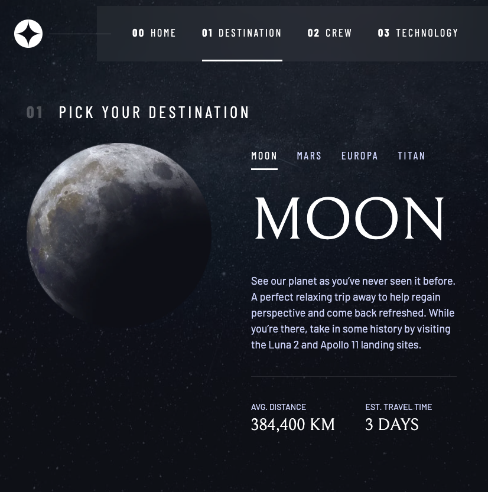
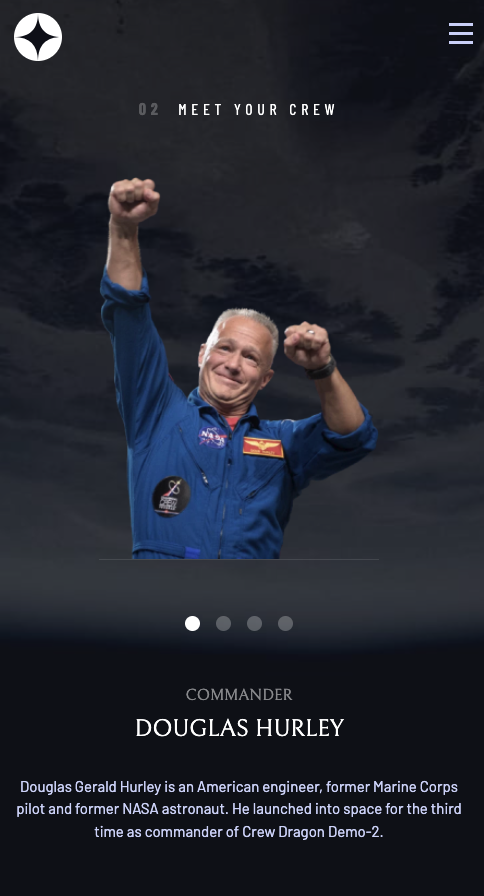
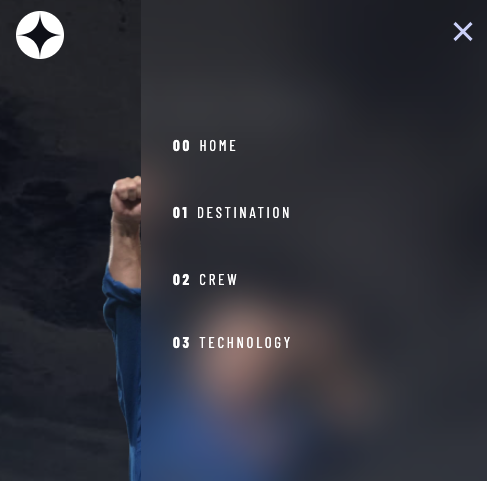

# Frontend Mentor - Space tourism website solution

This is a solution to the [Space tourism website challenge on Frontend Mentor](https://www.frontendmentor.io/challenges/space-tourism-multipage-website-gRWj1URZ3). Frontend Mentor challenges help you improve your coding skills by building realistic projects.

## Table of contents

- [Overview](#overview)
  - [The challenge](#the-challenge)
  - [Screenshot](#screenshot)
  - [Links](#links)
- [My process](#my-process)
  - [Built with](#built-with)
  - [What I learned](#what-i-learned)
  - [Continued development](#continued-development)
- [Author](#author)
- [Acknowledgments](#acknowledgments)

## Overview

### The challenge

Users should be able to:

- View the optimal layout for each of the website's pages depending on their device's screen size
- See hover states for all interactive elements on the page
- View each page and be able to toggle between the tabs to see new information

### Screenshot

### Links

- Solution URL: [Frontend mentor solution](https://www.frontendmentor.io/solutions/responsive-mobile-first-space-tourism-page-RZOksPfUkW)
- Live Site URL: [deployed with netlify](https://tourmaline-biscuit-d23dd3.netlify.app/)

## My process

### Built with

- Semantic HTML5 markup
- CSS custom properties
- Flexbox
- CSS Grid
- Mobile-first workflow

### What I learned

Part of this was a tutorial from Kevin Powell. I wanted to get a better grasp on layout and using utility classes and after building this site I think I have that.

### Continued development

I would definitely like to rebuild this with react and sass

## Author

- LinkedIn - [Layne Taylor](https://www.linkedin.com/in/layne-taylor/)
- Frontend Mentor - [@laynet](https://www.frontendmentor.io/profile/laynet)
- Twitter - [@laynerzzzz](https://www.twitter.com/laynerzzzz)

## Acknowledgments

Obv Kevin Powell, the CSS god.
